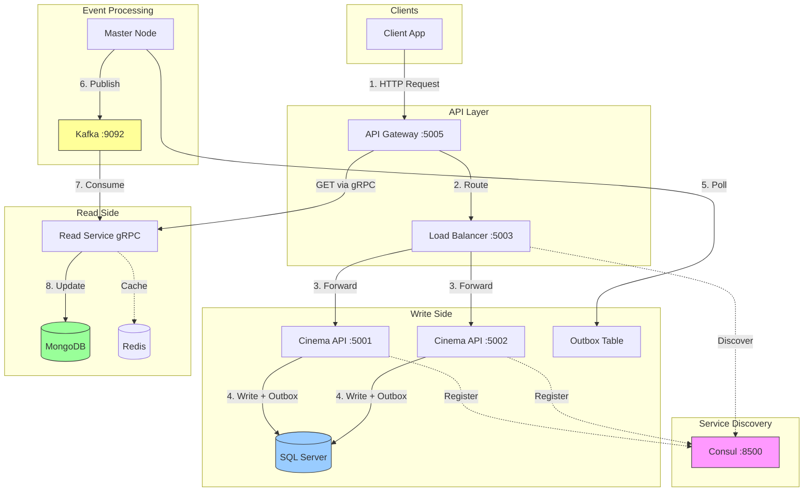
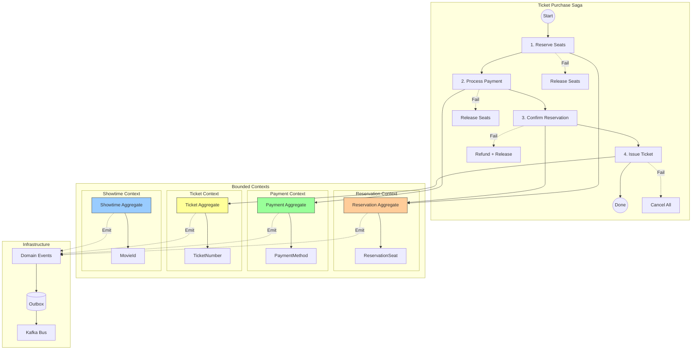

# Cinema Booking System

A distributed microservices cinema booking platform built with **.NET 8** and **Clean Architecture**.

## Key Patterns

| Pattern | Description |
|---------|-------------|
| **CQRS** | SQL Server (write) + MongoDB (read) |
| **Saga Orchestration** | Distributed transactions with compensation |
| **Transactional Outbox** | Guaranteed event delivery via Kafka |
| **Service Discovery** | Consul-based dynamic registration |
| **JWT Authentication** | Role-based authorization |

## Tech Stack

**.NET 8** | **SQL Server** | **MongoDB** | **Redis** | **Kafka** | **Consul** | **YARP** | **gRPC**

---

## Diagram 1: Architecture and Data Flow



**Data Flow:**
1. Client sends request to API Gateway (JWT authenticated)
2. Gateway routes through Load Balancer
3. Load Balancer discovers healthy instances via Consul
4. API writes data + outbox message (atomic transaction)
5. Master Node polls outbox for new messages
6. Events published to Kafka
7. Read Service consumes events
8. MongoDB updated, Redis cache invalidated

---

## Diagram 2: DDD Bounded Contexts and Saga



**Saga Steps:**

| Step | Action | Compensation |
|------|--------|--------------|
| 1 | Reserve Seats | Release Seats |
| 2 | Process Payment | Refund Payment |
| 3 | Confirm Reservation | Cancel Reservation |
| 4 | Issue Ticket | Void Ticket |

---

## Quick Start

```bash
# Start infrastructure
docker-compose -f docker-compose.infrastructure.yml up -d

# Start services
docker-compose up -d
```

## Services

| Service | URL |
|---------|-----|
| API Gateway | http://localhost:5005 |
| Consul UI | http://localhost:8500 |
| Swagger | http://localhost:8080/swagger |
| Kafka UI | http://localhost:8090 |

## Project Structure

```
src/
├── Cinema.Api/           # Write API
├── Cinema.ApiGateway/    # YARP Gateway
├── Cinema.LoadBalancer/  # Load Balancer + Consul
├── Cinema.ReadService/   # gRPC Read Service
├── Cinema.MasterNode/    # Outbox Processor
├── Cinema.Application/   # CQRS + Sagas
├── Cinema.Domain/        # DDD Aggregates
├── Cinema.Infrastructure/# EF Core, Kafka, Consul
└── Cinema.Contracts/     # DTOs
```

## License

MIT
