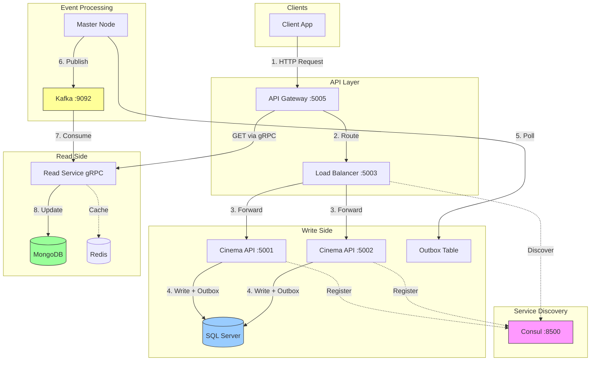
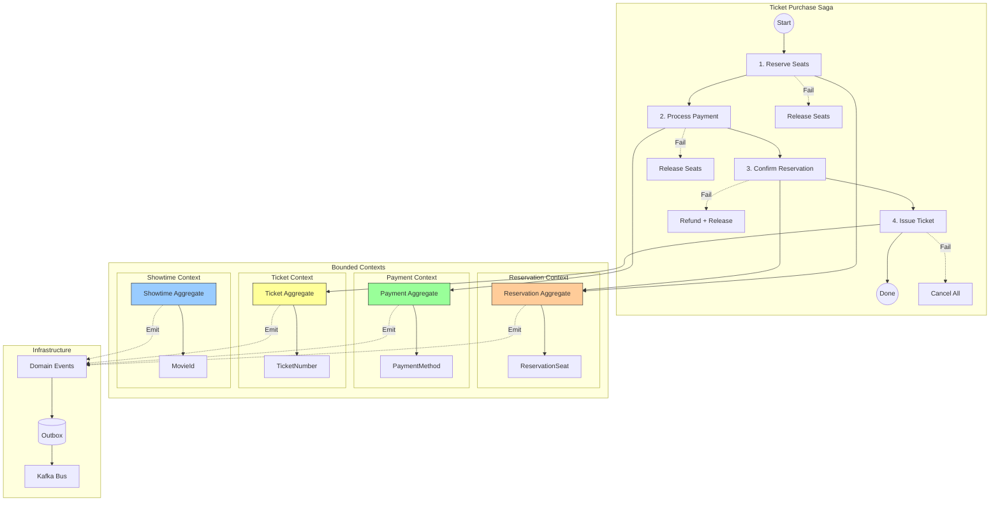
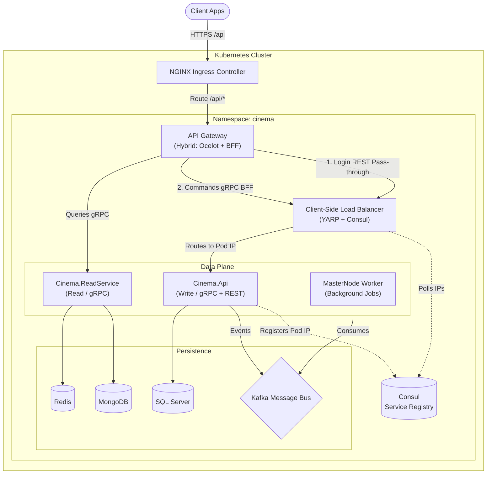

# Cinema Booking System

A distributed microservices cinema booking platform built with **.NET 8** and **Clean Architecture**.

## Key Patterns

| Pattern | Description |
|---------|-------------|
| **CQRS** | SQL Server (write) + MongoDB (read) |
| **Saga Orchestration** | Distributed transactions with compensation |
| **Transactional Outbox** | Guaranteed event delivery via Kafka |
| **Service Discovery** | Consul-based dynamic registration |
| **JWT Authentication** | Role-based authorization |

## Tech Stack

**.NET 8** | **SQL Server** | **MongoDB** | **Redis** | **Kafka** | **Consul** | **YARP** | **gRPC** | **OpenTelemetry**

## Observability Stack

The system implements a full observability solution using **OpenTelemetry** standards:

| Component | Purpose | Tool | Port (UI) |
|-----------|---------|------|------|
| **Logging** | Centralized structured logging | **Seq** | `:5341` |
| **Tracing** | Distributed request tracing | **Jaeger** | `:16686` |
| **Metrics** | Infrastructure & App metrics | **Prometheus** | `:9090` |

---

## Diagram 1: Architecture and Data Flow



**Data Flow:**
1. Client sends request to API Gateway (JWT authenticated)
2. Gateway routes through Load Balancer
3. Load Balancer discovers healthy instances via Consul
4. API writes data + outbox message (atomic transaction)
5. Master Node polls outbox for new messages
6. Events published to Kafka
7. Read Service consumes events
8. MongoDB updated, Redis cache invalidated

---

## Diagram 2: DDD Bounded Contexts and Saga



**Saga Steps:**

| Step | Action | Compensation |
|------|--------|--------------|
| 1 | Reserve Seats | Release Seats |
| 2 | Process Payment | Refund Payment |
| 3 | Confirm Reservation | Cancel Reservation |
| 4 | Issue Ticket | Void Ticket |

---

## Diagram 3: Observability Pipeline

```mermaid
graph LR
    subgraph "Application"
        API[Api Services]
        GW[Gateway]
        Nodes[Worker Nodes]
    end

    subgraph "Agents/Exporters"
        OTEL[OpenTelemetry SDK]
        Seri[Serilog Sink]
    end

    subgraph "Observability Backend"
        Seq[Seq (Logs)]
        Jaeger[Jaeger (Traces)]
        Prom[Prometheus (Metrics)]
    end
    
    subgraph "Visualization"
        Graf[Grafana]
        SeqUI[Seq UI]
        JaegerUI[Jaeger UI]
    end

    API & GW & Nodes --> OTEL
    API & GW & Nodes --> Seri
    
    Seri -->|Push Logs| Seq
    OTEL -->|Push Traces| Jaeger
    Prom -->|Scrape Metrics| API & GW & Nodes

    Seq --> SeqUI
    Jaeger --> JaegerUI
    Prom --> Graf
    
    style Seq fill:#f9f,stroke:#333
    style Jaeger fill:#9cf,stroke:#333
    style Prom fill:#ff9,stroke:#333
```

---

## Quick Start

```bash
# Start infrastructure
docker-compose -f docker-compose.infrastructure.yml up -d

# Start services
docker-compose up -d
```

## Services

| Service | URL |
|---------|-----|
| API Gateway | http://localhost:5005 |
| Consul UI | http://localhost:8500 |
| Swagger | http://localhost:8080/swagger |
| Kafka UI | http://localhost:8090 |

## Project Structure

```
src/
├── Cinema.Api/           # Write API
├── Cinema.ApiGateway/    # YARP Gateway
├── Cinema.LoadBalancer/  # Load Balancer + Consul
├── Cinema.ReadService/   # gRPC Read Service
├── Cinema.MasterNode/    # Outbox Processor
├── Cinema.Application/   # CQRS + Sagas
├── Cinema.Domain/        # DDD Aggregates
├── Cinema.Infrastructure/# EF Core, Kafka, Consul
└── Cinema.Contracts/     # DTOs
```

---

## Kubernetes Deployment

The project includes Kubernetes manifests for production deployment with native load balancing.

### Diagram 3: Kubernetes Architecture with Load Balancing



### How Kubernetes Load Balancing Works

**1. External Load Balancer (Layer 4)**
```
Internet → Cloud Load Balancer → Ingress Controller
```
- Cloud providers (AWS/Azure/GCP) provision a Layer 4 load balancer
- Distributes traffic across Ingress Controller pods

**2. Ingress Controller (Layer 7)**
```
Ingress → Service (ClusterIP)
```
- Nginx Ingress handles SSL termination, path routing
- Routes `/api/*` to `api-gateway-service`

**3. Kubernetes Service (kube-proxy)**
```
Service → Pod endpoints (Round Robin)
```
- `cinema-api-service` load balances across all API pods
- Uses iptables/IPVS rules for round-robin distribution
- Health checks via readiness probes

**4. Horizontal Pod Autoscaler (HPA)**
```
CPU/Memory metrics → Scale pods 3-10
```
- Automatically scales API pods based on load
- Maintains minimum 3 replicas for high availability

### Kubernetes vs Docker Compose Load Balancing

| Aspect | Docker Compose | Kubernetes |
|--------|---------------|------------|
| **Load Balancer** | Custom YARP + Consul | Native Service + kube-proxy |
| **Service Discovery** | Consul | Built-in DNS + Endpoints |
| **Auto-scaling** | Manual | HPA (automatic) |
| **Health Checks** | Custom | Liveness/Readiness probes |
| **SSL Termination** | Application | Ingress Controller |
| **Rolling Updates** | Manual | Built-in strategy |

### Deploy to Kubernetes

```bash
# Create namespace and deploy all resources
kubectl apply -k k8s/

# Or deploy individually
kubectl apply -f k8s/namespace.yaml
kubectl apply -f k8s/configmap.yaml
kubectl apply -f k8s/secrets.yaml
kubectl apply -f k8s/infrastructure.yaml
kubectl apply -f k8s/observability.yaml
kubectl apply -f k8s/cinema-api.yaml
kubectl apply -f k8s/api-gateway.yaml
kubectl apply -f k8s/read-service.yaml
kubectl apply -f k8s/master-node.yaml
kubectl apply -f k8s/ingress.yaml

# Check deployment status
kubectl get pods -n cinema
kubectl get services -n cinema
kubectl get hpa -n cinema

# View logs
kubectl logs -f deployment/cinema-api -n cinema

# Scale manually (if needed)
kubectl scale deployment cinema-api --replicas=5 -n cinema
```

### K8s Files Structure

```
k8s/
├── namespace.yaml      # Namespace definition
├── configmap.yaml      # Configuration data
├── secrets.yaml        # Sensitive data (base64)
├── infrastructure.yaml # SQL, MongoDB, Redis, Kafka
├── cinema-api.yaml     # API + HPA + PDB
├── api-gateway.yaml    # Gateway + LoadBalancer Service
├── read-service.yaml   # Read Service + HPA
├── master-node.yaml    # Outbox processor
├── ingress.yaml        # Ingress + Network Policy
└── kustomization.yaml  # Kustomize config
```
