#  Cinema Reservation System

A high-performance, distributed reservation system for cinemas, built with **.NET 8**, **Clean Architecture**, and **Domain-Driven Design (DDD)**. Designed for scalability, resilience, and real-world production readiness.

---

## 📖 Overview

This system demonstrates a production-grade implementation of:

* ✅ Clean Architecture
* ✅ Domain-Driven Design (DDD)
* ✅ CQRS (Command Query Responsibility Segregation)
* ✅ Event-Driven Consistency via Kafka
* ✅ **Saga Pattern for Distributed Transactions**

It separates **write operations** (business logic) from **read operations** (queries), ensuring high throughput and eventual consistency.


---

##  Features

### 🎥 Showtime Management

* Create and schedule movie showtimes per auditorium
* Conflict detection to prevent overlapping screenings

### 🎟️ Reservation System

* Reserve specific seats for a showtime
* 10-minute hold mechanism with automatic expiration
* Confirm reservations before expiration

### 💳 Ticket Purchase (Saga Pattern)

* Orchestrated multi-step transaction
* Automatic compensation on failure
* Payment processing with refund support

### ⚡ High-Performance Querying

* Dedicated Read Service backed by MongoDB
* Low-latency queries independent of transactional load

---

## 🏗️ Architecture

### 🧠 CQRS Pattern

* **Write Side**:  
  `.NET 8 API → SQL Server → Entity Framework Core`
* **Read Side**:  
  `.NET 8 gRPC Service → MongoDB`

### 🧱 Domain-Driven Design

* Rich Aggregates: `Reservation`, `Showtime`, `Payment`, `Ticket`
* Value Objects: `SeatNumber`, `Money`
* Internal expiration logic:  
  `ExpiresAt = CreatedAt.AddMinutes(10)`

### 🔁 Event-Driven Consistency (Outbox Pattern)

* Domain events saved to `OutboxMessages` table
* Background job publishes events to Kafka
* Read Service consumes Kafka events → updates MongoDB

---

## 🧩 Infrastructure

* **API Gateway**: Ocelot
* **Load Balancer**: YARP
* **Messaging**: Kafka + Zookeeper
* **Cache**: Redis
* **Containerization**: Docker + Docker Compose
* **Communication**: REST + gRPC

---

## 🧬 Tech Stack

| Layer | Technology |
| --- | --- |
| Framework | .NET 8 (C#) |
| Write DB | SQL Server 2022 |
| Read DB | MongoDB 7.0 |
| Cache | Redis |
| Messaging | Apache Kafka + Zookeeper |
| Gateway | Ocelot |
| Load Balancer | YARP |
| Container | Docker + Compose |

---

## 🏗️ Architecture Overview

```mermaid
graph TB
    subgraph "Entry Point"
        Gateway["🌐 API Gateway<br/>Ocelot"]
        LB["⚖️ Load Balancer<br/>YARP"]
    end

    subgraph "Write Side - Commands"
        API1["⚙️ Cinema API 1<br/>Port 5001"]
        API2["⚙️ Cinema API 2<br/>Port 5002"]
        
        subgraph "🎭 SAGA ORCHESTRATOR"
            SagaOrch["TicketPurchaseSaga"]
            Step1["1️⃣ ReserveSeats"]
            Step2["2️⃣ ProcessPayment"]
            Step3["3️⃣ ConfirmReservation"]
            Step4["4️⃣ IssueTicket"]
            SagaOrch --> Step1
            Step1 --> Step2
            Step2 --> Step3
            Step3 --> Step4
        end
        
        SQL["🗄️ SQL Server<br/>Write DB"]
        SagaState["📋 SagaStates<br/>Table"]
        Outbox["🔄 Outbox Job<br/>Every 10s"]
    end
    
    subgraph "Background Services"
        Recovery["🔧 SagaRecoveryService<br/>Every 30s"]
        Expiration["⏰ ReservationExpiration<br/>Every 1m"]
    end
    
    subgraph "Event Streaming"
        Kafka["📨 Kafka Broker<br/>Port 9092"]
        Topic1["Topic: cinema.domain.events"]
        Topic2["Topic: cinema.saga.events"]
    end
    
    subgraph "Read Side - Queries"
        Consumer["📥 Kafka Consumer<br/>Read Service"]
        ReadService["🚀 Read Service<br/>gRPC Port 7080"]
        
        subgraph "MongoDB Replica Set"
            Mongo1["🍃 Primary"]
            Mongo2["🍃 Secondary"]
            Mongo3["🍃 Secondary"]
        end

        Redis["⚡ Redis<br/>Cache"]
    end
    
    subgraph "External Services"
        PaymentGW["💳 Payment Gateway"]
        NotifySvc["📧 Notification Service"]
    end
    
    Gateway -->|POST/PUT| LB
    LB --> API1
    LB --> API2
    
    API1 -->|Execute Saga| SagaOrch
    API2 -->|Execute Saga| SagaOrch
    
    Step1 -->|Reserve| SQL
    Step2 -->|Charge| PaymentGW
    Step3 -->|Confirm| SQL
    Step4 -->|Issue & Notify| NotifySvc
    
    SagaOrch -->|Save State| SagaState
    SagaState --> SQL
    
    SQL -->|Poll| Outbox
    Outbox -->|Publish| Kafka
    Kafka -->|Stream| Topic1
    Kafka -->|Stream| Topic2
    
    Recovery -->|Check| SagaState
    Expiration -->|Check| SQL
    
    Topic1 -.->|Consume| Consumer
    Consumer -.->|Update| Mongo1
    Mongo1 -.->|Replicate| Mongo2
    Mongo1 -.->|Replicate| Mongo3
    
    Gateway -->|GET gRPC| ReadService
    ReadService -->|Query| Mongo1
    ReadService -.->|Cache| Redis
    
    style SagaOrch fill:#ff9800,stroke:#e65100,stroke-width:2px,color:#fff
    style Step1 fill:#4caf50,stroke:#2e7d32,color:#fff
    style Step2 fill:#2196f3,stroke:#1565c0,color:#fff
    style Step3 fill:#9c27b0,stroke:#6a1b9a,color:#fff
    style Step4 fill:#f44336,stroke:#c62828,color:#fff
```



---

## 🎭 Saga Pattern Implementation

The Saga Pattern manages distributed transactions across multiple bounded contexts. This implementation uses the **Orchestration-based approach** where a central coordinator controls the transaction flow.

### Why Saga Pattern?


### Solution: Saga with Compensations


### Ticket Purchase Saga Flow

```mermaid
graph TD
    Start([🎬 Customer Request<br/>POST /api/ticketpurchase]) --> CreateSaga
    
    CreateSaga[Create SagaState<br/>Status: Started] --> Step1
    
    subgraph "🔄 Forward Execution"
        Step1["1️⃣ ReserveSeatsStep<br/>──────────────<br/>• Check seat availability<br/>• Create Reservation<br/>• Mark seats reserved"]
        Step2["2️⃣ ProcessPaymentStep<br/>──────────────<br/>• Create Payment record<br/>• Call Payment Gateway<br/>• Save transaction ID"]
        Step3["3️⃣ ConfirmReservationStep<br/>──────────────<br/>• Confirm Reservation<br/>• Mark seats as sold"]
        Step4["4️⃣ IssueTicketStep<br/>──────────────<br/>• Create Ticket<br/>• Generate QR code<br/>• Send notification"]
    end
    
    Step1 -->|✅ Success| Step2
    Step2 -->|✅ Success| Step3
    Step3 -->|✅ Success| Step4
    Step4 -->|✅ Success| Complete([🎫 Ticket Issued<br/>Return TicketNumber])
    
    Step1 -->|❌ Seats unavailable| FailEarly([❌ Fail: Seats not available])
    Step2 -->|❌ Payment declined| StartComp
    Step3 -->|❌ Error| StartComp2
    Step4 -->|❌ Error| StartComp3
    
    subgraph "↩️ Compensation Flow (Reverse Order)"
        StartComp3[Start Compensation] --> Comp4
        StartComp2[Start Compensation] --> Comp3
        StartComp[Start Compensation] --> Comp2
        
        Comp4["🔙 Cancel Ticket<br/>ticket.Cancel()"]
        Comp3["🔙 Refund Payment<br/>paymentGateway.Refund()"]
        Comp2["🔙 Release Seats<br/>showtime.ReleaseSeats()"]
        Comp1["🔙 Cancel Reservation<br/>reservation.Cancel()"]
        
        Comp4 --> Comp3
        Comp3 --> Comp2
        Comp2 --> Comp1
    end
    
    Comp1 --> Compensated([⚠️ Compensated<br/>Return Error])
    
    style Step1 fill:#4caf50,stroke:#2e7d32,color:#fff
    style Step2 fill:#2196f3,stroke:#1565c0,color:#fff
    style Step3 fill:#9c27b0,stroke:#6a1b9a,color:#fff
    style Step4 fill:#f44336,stroke:#c62828,color:#fff
    style Comp1 fill:#ff9800,stroke:#e65100,color:#fff
    style Comp2 fill:#ff9800,stroke:#e65100,color:#fff
    style Comp3 fill:#ff9800,stroke:#e65100,color:#fff
    style Comp4 fill:#ff9800,stroke:#e65100,color:#fff
```



### Saga State Machine


### Saga Components


### Saga Statuses

| Status | Description |
|--------|-------------|
| `Started` | Saga has been initiated |
| `Running` | Steps are being executed |
| `Completed` | All steps completed successfully |
| `Compensating` | Rollback is in progress |
| `Compensated` | Rollback completed |
| `Failed` | Critical error occurred |
| `TimedOut` | Saga exceeded 10-minute timeout |

### Saga Sequence Diagram (Success Flow)


### Saga Sequence Diagram (Failure with Compensation)


---

## ⚡ Async Processing Services


---

## 📡 API Endpoints

### Showtimes API

#### Create Showtime

```http
POST /api/showtimes
Content-Type: application/json

{
  "movieImdbId": "tt1375666",
  "screeningTime": "2025-12-12T20:00:00Z",
  "auditoriumId": "0C7F275C-A5EA-456C-BBF9-4DAC0B028E73"
}
```

**Response (201 Created):**
```json
{
  "id": "34306464-2135-4992-89b1-3e25839fbc4f",
  "movieImdbId": "tt1375666",
  "movieTitle": "Inception",
  "screeningTime": "2025-12-12T20:00:00Z",
  "auditoriumId": "0C7F275C-A5EA-456C-BBF9-4DAC0B028E73",
  "status": "Open"
}
```

#### Get All Showtimes

```http
GET /api/showtimes
```

**Response (200 OK):**
```json
[
  {
    "id": "34306464-2135-4992-89b1-3e25839fbc4f",
    "movieImdbId": "tt1375666",
    "movieTitle": "Inception",
    "screeningTime": "2025-12-12T20:00:00Z",
    "availableSeats": 85
  }
]
```

#### Get Showtime by ID

```http
GET /api/showtimes/{id}
```

**Response (200 OK):**
```json
{
  "id": "34306464-2135-4992-89b1-3e25839fbc4f",
  "movieImdbId": "tt1375666",
  "movieTitle": "Inception",
  "screeningTime": "2025-12-12T20:00:00Z",
  "auditoriumId": "0C7F275C-A5EA-456C-BBF9-4DAC0B028E73",
  "ticketPrice": 12.50,
  "totalSeats": 100,
  "availableSeats": 85,
  "status": "Open"
}
```

---

### Reservations API

#### Create Reservation

```http
POST /api/reservations
Content-Type: application/json

{
  "showtimeId": "34306464-2135-4992-89b1-3e25839fbc4f",
  "seats": [
    { "row": 5, "number": 10 },
    { "row": 5, "number": 11 }
  ]
}
```

**Response (201 Created):**
```json
{
  "id": "a1b2c3d4-5678-90ab-cdef-1234567890ab",
  "showtimeId": "34306464-2135-4992-89b1-3e25839fbc4f",
  "seats": [
    { "row": 5, "number": 10 },
    { "row": 5, "number": 11 }
  ],
  "status": "Reserved",
  "expiresAt": "2025-01-08T12:10:00Z",
  "totalPrice": 25.00
}
```

#### Confirm Reservation

```http
PUT /api/reservations/{id}/confirm
Content-Type: application/json

{
  "paymentId": "pay-123456"
}
```

**Response (200 OK):**
```json
{
  "id": "a1b2c3d4-5678-90ab-cdef-1234567890ab",
  "status": "Confirmed",
  "paymentId": "pay-123456"
}
```

#### Cancel Reservation

```http
DELETE /api/reservations/{id}
```

**Response (204 No Content)**

#### Get Reservation by ID

```http
GET /api/reservations/{id}
```

**Response (200 OK):**
```json
{
  "id": "a1b2c3d4-5678-90ab-cdef-1234567890ab",
  "showtimeId": "34306464-2135-4992-89b1-3e25839fbc4f",
  "customerId": "customer-123",
  "seats": [
    { "row": 5, "number": 10 },
    { "row": 5, "number": 11 }
  ],
  "status": "Reserved",
  "createdAt": "2025-01-08T12:00:00Z",
  "expiresAt": "2025-01-08T12:10:00Z",
  "totalPrice": 25.00
}
```

---

### Ticket Purchase API (Saga)

#### Purchase Ticket

```http
POST /api/ticketpurchase
Content-Type: application/json

{
  "showtimeId": "34306464-2135-4992-89b1-3e25839fbc4f",
  "customerId": "customer-123",
  "seats": [
    { "row": 5, "number": 10 },
    { "row": 5, "number": 11 }
  ],
  "paymentMethod": "CreditCard",
  "cardNumber": "4111111111111111",
  "cardHolderName": "John Doe"
}
```

**Success Response (200 OK):**
```json
{
  "success": true,
  "ticketId": "ticket-abc123",
  "ticketNumber": "TKT-20250108123456-1234",
  "reservationId": "a1b2c3d4-5678-90ab-cdef-1234567890ab",
  "paymentId": "pay-xyz789",
  "movieTitle": "Inception",
  "screeningTime": "2025-12-12T20:00:00Z",
  "seats": [
    { "row": 5, "number": 10 },
    { "row": 5, "number": 11 }
  ],
  "totalPrice": 25.00
}
```

**Failure Response (400 Bad Request):**
```json
{
  "success": false,
  "error": "Compensated: Payment declined - insufficient funds",
  "sagaId": "saga-123456"
}
```

#### Get Saga Status

```http
GET /api/ticketpurchase/{sagaId}/status
```

**Response (200 OK):**
```json
{
  "sagaId": "saga-123456",
  "status": "Completed",
  "currentStep": 4,
  "totalSteps": 4,
  "failureReason": null,
  "createdAt": "2025-01-08T12:00:00Z",
  "completedAt": "2025-01-08T12:00:05Z",
  "ticketId": "ticket-abc123",
  "ticketNumber": "TKT-20250108123456-1234",
  "stepLogs": [
    {
      "stepName": "ReserveSeats",
      "success": true,
      "message": "Reserved 2 seats",
      "timestamp": "2025-01-08T12:00:01Z"
    },
    {
      "stepName": "ProcessPayment",
      "success": true,
      "message": "Payment processed, TransactionId: TXN-abc123",
      "timestamp": "2025-01-08T12:00:02Z"
    },
    {
      "stepName": "ConfirmReservation",
      "success": true,
      "message": "Reservation confirmed",
      "timestamp": "2025-01-08T12:00:03Z"
    },
    {
      "stepName": "IssueTicket",
      "success": true,
      "message": "Ticket issued: TKT-20250108123456-1234",
      "timestamp": "2025-01-08T12:00:04Z"
    }
  ]
}
```

---

### Payments API

#### Get Payment by ID

```http
GET /api/payments/{id}
```

**Response (200 OK):**
```json
{
  "id": "pay-xyz789",
  "reservationId": "a1b2c3d4-5678-90ab-cdef-1234567890ab",
  "customerId": "customer-123",
  "amount": 25.00,
  "currency": "USD",
  "status": "Completed",
  "method": "CreditCard",
  "transactionId": "TXN-abc123",
  "processedAt": "2025-01-08T12:00:02Z"
}
```

#### Refund Payment

```http
POST /api/payments/{id}/refund
Content-Type: application/json

{
  "reason": "Customer request"
}
```

**Response (200 OK):**
```json
{
  "id": "pay-xyz789",
  "status": "Refunded",
  "refundedAmount": 25.00,
  "refundReason": "Customer request"
}
```

---

### Tickets API

#### Get Ticket by ID

```http
GET /api/tickets/{id}
```

**Response (200 OK):**
```json
{
  "id": "ticket-abc123",
  "ticketNumber": "TKT-20250108123456-1234",
  "reservationId": "a1b2c3d4-5678-90ab-cdef-1234567890ab",
  "paymentId": "pay-xyz789",
  "showtimeId": "34306464-2135-4992-89b1-3e25839fbc4f",
  "customerId": "customer-123",
  "movieTitle": "Inception",
  "screeningTime": "2025-12-12T20:00:00Z",
  "auditoriumName": "Hall 1",
  "seats": [
    { "row": 5, "number": 10 },
    { "row": 5, "number": 11 }
  ],
  "totalPrice": 25.00,
  "status": "Issued",
  "qrCode": "QR:ticket-abc123:TKT-20250108123456-1234"
}
```

#### Get Ticket by Number

```http
GET /api/tickets/by-number/{ticketNumber}
```

#### Validate Ticket

```http
POST /api/tickets/{id}/validate
```

**Response (200 OK):**
```json
{
  "valid": true,
  "ticketNumber": "TKT-20250108123456-1234",
  "movieTitle": "Inception",
  "screeningTime": "2025-12-12T20:00:00Z",
  "seats": "Row 5, Seats 10-11"
}
```

#### Use Ticket (Mark as Used)

```http
POST /api/tickets/{id}/use
```

**Response (200 OK):**
```json
{
  "id": "ticket-abc123",
  "status": "Used",
  "usedAt": "2025-12-12T19:55:00Z"
}
```

---

### Health Check API

```http
GET /health
```

**Response (200 OK):**
```json
{
  "status": "Healthy",
  "checks": {
    "database": "Healthy",
    "kafka": "Healthy",
    "redis": "Healthy"
  }
}
```

---

## 🧪 Testing

* Unit Tests: xUnit
* Assertions: FluentAssertions
* Integration Tests: Dockerized test environment

---

## 🚀 Getting Started

### Prerequisites

- Docker & Docker Compose
- .NET 8 SDK

### Start Infrastructure

```bash
# Start all services
docker-compose up -d

# Check status
docker-compose ps
```

### Run API

```bash
cd src/Cinema.API
dotnet run
```

### Available Services

| Service | URL |
|---------|-----|
| Cinema API | http://localhost:5001 |
| Swagger UI | http://localhost:5001/swagger |
| Kafka UI | http://localhost:8080 |
| SQL Server | localhost:1433 |
| MongoDB Primary | localhost:27017 |
| Redis | localhost:6379 |

---

## 📝 License

MIT License
